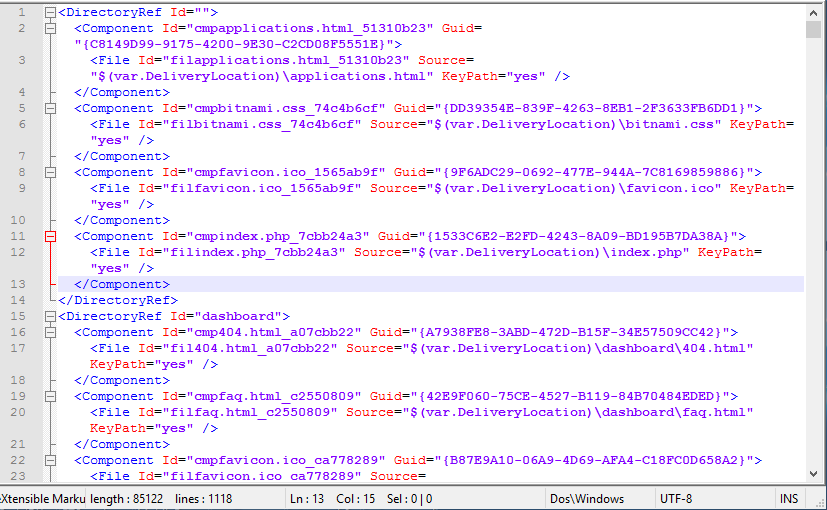

# msbuild-nant-wix-installer-tools
Build / CI related tools for .NET framework, MSBuild, NAnt, Wix installer

## NAnt Build Template Generator

  

  

How it works:
- Enter Root folder of solution: direct enter path to text box or Menu File -> New, File -> Open  
- Program will load all .NET project under root folder  
- Set which project need to build (by setting Weight = 1)  
- Menu File -> Load Ref Dependencies...: program can detect dependency among projects then order them accordingly. Note: loop reference cannot support, need to resolve manually  
- Save the configuration of solution to text file for later adjustment  
- Generate XML: generate NAnt xml script ready for NAnt & MSBuild compile & build  
- Change ProjectTargetTemplate.txt to fit project need  

Output sample
```
<?xml version="1.0" encoding="utf-8"?>
<project name="tfnantscriptgen" default="build" xmlns="http://nant.sf.net/release/0.92/nant.xsd">
	<target name="MyProject" description="MyProject" depends="preBuildTarget">
		<echo message="#### MyProject ####"/>
		<xmlpeek file="${path.root}\${src.dir}\MyProject\MyProject.csproj" xpath="//ns:AssemblyName" property="project.assembly">
			<namespaces>
				<namespace prefix="ns" uri="http://schemas.microsoft.com/developer/msbuild/2003" />
			</namespaces>
		</xmlpeek>
		<exec program="${msbuildpath}" commandline="${path.root}\${src.dir}\MyProject\MyProject.csproj ${build.config} ${reference.path}" failonerror="${project.failonerror}" resultproperty="build.result" />
		<choose>
			<when test="${build.result!='0'}">
				<property name="build.fail" value="${build.fail}, MyProject"/>
			</when>
			<otherwise>
				<echo message="## source code changed ##"/>
				<copy todir="${path.root}\${src.dir}\MyProject\bin\archive">
					<fileset basedir="${path.root}\${src.dir}\MyProject\bin\build">
						<include name="${project.assembly}.*"/>
					</fileset>
				</copy>
				<copy todir="${outputDir0}">
					<fileset basedir="${path.root}\${src.dir}\MyProject\bin\archive">
						<include name="${project.assembly}.*"/>
					</fileset>
				</copy>
			</otherwise>
		</choose>
	</target>
	<target name="build" description="Build all project" depends="MyProject">
		<if test="${build.fail!=''}">
			<echo message="#### Projects failed to build ####"/>
			<echo message="${build.fail}"/>
			<fail/>
		</if>
		<echo message="#### Finish Projects Built Target ####"/>
	</target>
</project>
```

### Usage  
- With hugh number of sub projects in solutions (100 - 200 sub projects which almost unable to add to 1 Visual Studio solution), this tool can help manage build, add/remove sub project easier.  
- Easy integrate with CI like Jenkins  

## Wix Installer

  

  

### Usage  
- Flexible in automatic or manual generated ComponentID, Guid, Directory, Feature, Condition, Field, Source...  
- Can be save / persisted for update next time  
- Can generate components by individual files or automatic generate for whole folder & sub files & folders  